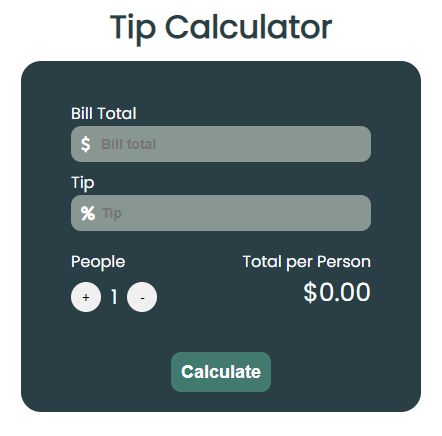

<h1 align="center"> Projecto Tip Calculator </h1>

Aplicação para calculo de gorjeta com tecnologias FrontEnd  

  <a href="#-tecnologias">Tecnologias</a>&nbsp;&nbsp;&nbsp;|&nbsp;&nbsp;&nbsp;
  <a href="#-projeto">Projeto</a>&nbsp;&nbsp;&nbsp;|&nbsp;&nbsp;&nbsp;
  <a href="#-layout">Layout</a>&nbsp;&nbsp;&nbsp;|&nbsp;&nbsp;&nbsp;
  <a href="#-licença">Licença</a>

 

  

## Tecnologias

Esse projeto foi desenvolvido com as seguintes tecnologias:

- HTML e CSS
- JavaScript
- Git e Github

## 💻 Projeto

Pode experimentar a aplicação no seguinte link <a href='https://nunoncunha.github.io/tipcalculator/'>Tip Calculator</a>

## Layout

## Licença
